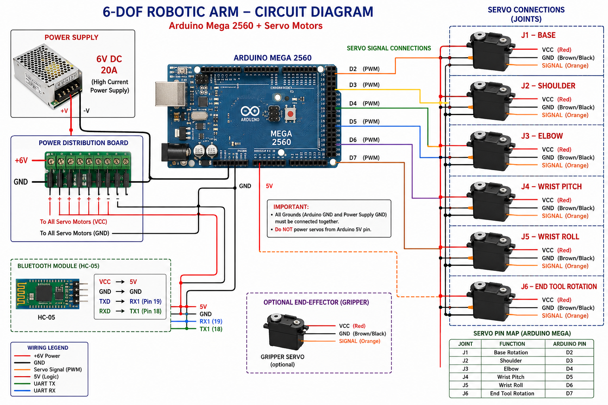
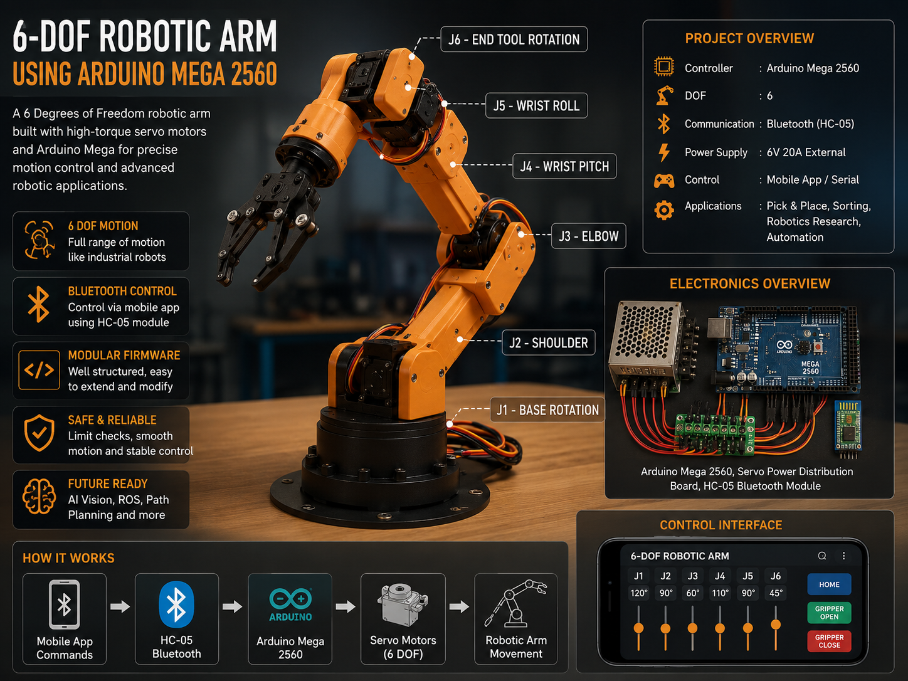

# 🤖 6-DOF Robotic Arm using Arduino Mega 2560


---

## 🚀 Project Overview

A professional **6 Degrees of Freedom (6-DOF) Robotic Arm** built using **Arduino Mega 2560**, high-torque servo motors, and Bluetooth communication.

This robotic arm replicates the motion of industrial robotic manipulators and is designed for:

- Pick and Place Operations
- Object Manipulation
- Motion Learning
- Bluetooth Remote Control
- AI Vision Integration
- Autonomous Operations

---

## 📸 Robotic Arm Structure

```text
             J6 Tool Rotation
                    │
             J5 Wrist Roll
                    │
             J4 Wrist Pitch
                    │
                J3 Elbow
                    │
             J2 Shoulder
                    │
              J1 Base
                    │
             Arduino Mega
```

---

## 🎯 Features

- ✅ 6 Degrees of Freedom
- ✅ Arduino Mega Based
- ✅ Bluetooth Control
- ✅ Modular Firmware Architecture
- ✅ Forward Kinematics
- ✅ Inverse Kinematics Ready
- ✅ Smooth Motion Control
- ✅ Gripper Support
- ✅ Future ROS Integration
- ✅ Future AI Vision Integration

---

## 🛠 Hardware Requirements

| Component                   | Quantity    |
| --------------------------- | ----------- |
| Arduino Mega 2560           | 1           |
| DS3235 35KG Servo           | 3           |
| DS3218 20KG Servo           | 2           |
| MG996R Servo                | 1           |
| MG90S Servo (Gripper)       | 1           |
| HC-05 Bluetooth Module      | 1           |
| 6V 20A Power Supply         | 1           |
| Power Distribution Board    | 1           |
| Servo Brackets              | As Required |
| Bearings                    | As Required |
| Aluminum / 3D Printed Parts | As Required |

---

## 🔌 Wiring Configuration

### Servo Connections

| Joint   | Function      | Arduino Pin |
| ------- | ------------- | ----------- |
| J1      | Base Rotation | D2          |
| J2      | Shoulder      | D3          |
| J3      | Elbow         | D4          |
| J4      | Wrist Pitch   | D5          |
| J5      | Wrist Roll    | D6          |
| J6      | Tool Rotation | D7          |
| Gripper | End Effector  | D8          |

---

### HC-05 Bluetooth Connections

| HC-05 | Arduino Mega |
| ----- | ------------ |
| VCC   | 5V           |
| GND   | GND          |
| TXD   | RX1 (Pin 19) |
| RXD   | TX1 (Pin 18) |

---

## ⚡ Power Distribution

> ⚠️ Never power servo motors directly from the Arduino Mega.

Use:

```text
6V 20A External Power Supply
```

Connection:

```text
Power Supply +V → Servo VCC

Power Supply GND → Servo GND

Arduino GND → Servo GND
```

All grounds must be connected together.

---

## 📂 Firmware Structure

```text
robotic-arm-6dof/

│
├── robotic-arm-6dof.ino
│
├── config/
│   ├── config.h
│   └── pins.h
│
├── joints/
│   ├── joints.h
│   └── joints.cpp
│
├── kinematics/
│   ├── fk.h
│   ├── fk.cpp
│   ├── ik.h
│   └── ik.cpp
│
├── motion/
│   ├── trajectory.h
│   ├── trajectory.cpp
│
├── communication/
│   ├── serial_cmd.h
│   ├── serial_cmd.cpp
│   ├── bluetooth.h
│   └── bluetooth.cpp
│
├── gripper/
│   ├── gripper.h
│   └── gripper.cpp
│
├── safety/
│   ├── safety.h
│   └── safety.cpp
│
└── utils/
```

---

## ⚙️ Installation

### Clone Repository

```bash
git clone https://github.com/ShivamMathtech/robotic-arm-6dof.git
```

### Open Project

```text
Arduino IDE
→ Open robotic-arm-6dof.ino
```

### Install Dependencies

```text
Servo Library
```

(Already included with Arduino IDE)

### Upload Firmware

1. Connect Arduino Mega
2. Select Board → Arduino Mega 2560
3. Select COM Port
4. Click Upload

---

## 📡 Bluetooth Commands

Control joints using Bluetooth:

```text
J1:120
J2:90
J3:45
J4:135
J5:90
J6:60
```

Example:

```text
J1:180
```

Rotates the base joint to 180°.

---

## 🤖 Forward Kinematics

Robot transformation:

```math
T = T1 × T2 × T3 × T4 × T5 × T6
```

Where:

```text
T1 = Base
T2 = Shoulder
T3 = Elbow
T4 = Wrist Pitch
T5 = Wrist Roll
T6 = End Effector Rotation
```

---

## 🎮 Future Upgrades

### AI Vision

- YOLO Object Detection
- OpenCV Integration
- ESP32-CAM
- USB Camera

### Wireless Control

- Wi-Fi Control
- ESP32 Integration
- Cloud Monitoring

### Industrial Features

- ROS Integration
- Teach & Repeat
- Path Planning
- Motion Interpolation
- Autonomous Pick & Place

---

## 📈 Development Roadmap

### Phase 1

- Mechanical Design

### Phase 2

- Servo Integration

### Phase 3

- Arduino Firmware

### Phase 4

- Bluetooth Control

### Phase 5

- Forward Kinematics

### Phase 6

- Inverse Kinematics

### Phase 7

- AI Vision

### Phase 8

- ROS Integration

### Phase 9

- Autonomous Manipulation

---

## 📷 Circuit Diagram

Add your generated circuit diagram here:

```markdown

```

---

## 📷 Robotic Arm Image

```markdown

```

---

## 🤝 Contributing

Contributions are welcome.

```bash
Fork → Create Branch → Commit → Push → Pull Request
```

---

## 📜 License

This project is licensed under the MIT License.

See the [LICENSE](LICENSE) file for details.

---

## 👨‍💻 Author

### Shivam Singh

Embedded Systems Engineer • Robotics Developer • IoT Enthusiast

GitHub:

https://github.com/ShivamMathtech

---

## ⭐ Support

If you found this project useful:

⭐ Star the repository

🍴 Fork the repository

📢 Share with the robotics community

---

### "Building the Future of Robotics with Arduino, AI, and Automation 🚀"
